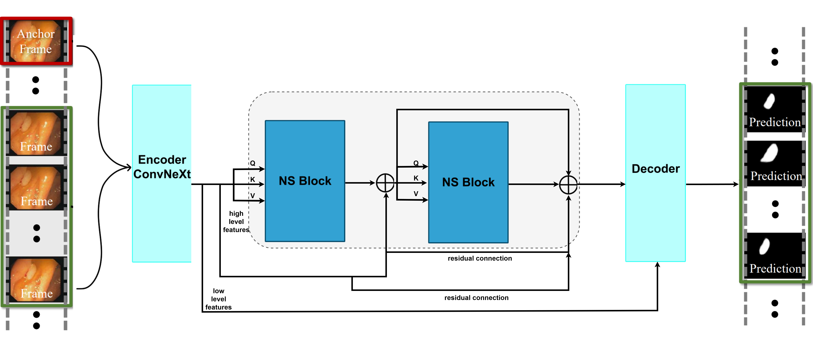

# Speed-Performance Balance in Constrained Attention-based Models for Endoscopy Video Sequences

This is the repository for the paper "Speed-Performance Balance in Constrained Attention-based Models for Endoscopy Video Sequences", based on the one from the [PNS+](https://github.com/GewelsJI/VPS).

<p align="center">
    
</p>

>
>
### Dataset
>
Instructions for setting up the dataset in [`DATA_PREPARATION`](https://github.com/GewelsJI/VPS/blob/main/docs/DATA_PREPARATION.md), including instructions for accessing the [SUN-database](http://amed8k.sundatabase.org).
>
### Training
>
For training use this script:
>
```shell
python my_train.py
```
>
### Testing
>
For testing first use the script from below to get the images, then use the toolbox from the `/eval` directory:
>
```shell
python my_eval.py --pth_path [path_to_weights]
```

### Troubleshooting

- **`ImportError: .../self_cuda_backend...so: undefined symbol: _ZNK3c108SymFloat11guard_floatEPKcl`**
  The compiled `self_cuda_backend` CUDA extension was built against a different PyTorch version than the one currently installed. Rebuild it against the active environment's torch:
  ```shell
  cd lib/module/PNS
  rm -rf build self_cuda_backend*.so *.egg-info
  python setup.py install
  ```

- **`OSError: [Errno 16] Device or resource busy: '.nfsXXXXXXXX'` during startup**
  Harmless `multiprocessing` DataLoader worker cleanup errors that happen when the temp directory is on an NFS mount. Non-fatal — training continues past them.

- **`RuntimeError: Error(s) in loading state_dict for ConvNeXtV2: size mismatch for head.weight/head.bias`**
  The pretrained `convnextv2_base_22k_224_ema.pt` checkpoint published by FAIR has a 1000-class head, but `PNSPlusNetwork.py` requests `num_classes=21841`. The classifier head isn't used by the model (only the backbone feature extractor is), so `convnextv2_base()` in `lib/module/ConvNeXtV2.py` filters out `head.*` keys from the checkpoint before loading, avoiding the shape conflict.

- **`RuntimeError: CUDA out of memory` during training (e.g. at `--batchsize 8`)**
  Note that `video_time_clips` (default 6, `config.py`) is flattened into the batch dimension before the backbone (`PNSPlusNetwork.py`), so the effective batch through ConvNeXtV2 is `batchsize x video_time_clips`. This branch's `my_train.py` was missing automatic mixed precision (AMP), which earlier branches (e.g. `dc5a736`) used to fit larger batch sizes. Fixed by restoring plain fp16 AMP in `my_train.py`:
  - `from torch.cuda.amp import autocast, GradScaler`
  - forward pass + loss wrapped in `with autocast():`, backward via `scaler.scale(loss).backward()`
  - `scaler.unscale_(optimizer)` before gradient clipping
  - `optimizer.step()` replaced with `scaler.step(optimizer)` + `scaler.update()`
  - `scaler = GradScaler()` instantiated once before the training loop

  Use plain `autocast()` (no `dtype` kwarg) — some other branches use `autocast(dtype=torch.bfloat16)`, which raises `TypeError: __init__() got an unexpected keyword argument 'dtype'` on older PyTorch versions that don't support that argument.

  If `--batchsize 8` still OOMs after enabling AMP (ConvNeXtV2-base is a much heavier backbone than earlier models, and the effective per-forward batch is `batchsize x video_time_clips`), gradient checkpointing is applied to the four ConvNeXtV2 `stages[i]` calls, as well as the `block_h_1` KAN block (the one operating on the full-resolution 1024-channel feature, before `up_sample_high`), in `PNSPlusNetwork.py` (via `torch.utils.checkpoint.checkpoint`). This is mathematically exact — same architecture, same gradients — it only recomputes activations during backward instead of caching them, trading some compute time for memory. This lets `--batchsize 8` and `video_time_clips` stay unchanged. The same OOM was hit on the `model-MedNeXt-UKAN` branch and fixed the same way there, checkpointing `enc_block_0`/`enc_block_1` (MedNeXt's highest-resolution stages) and its own `block_h_1` KAN loop — `block_h_2` was left un-checkpointed on both branches since it operates on a much smaller 32-channel feature.

  Note: `model-MedNeXt-UKAN`'s `my_train.py` still has the unfixed `autocast(dtype=torch.bfloat16)` bug described above — apply the same plain-`autocast()` fix there before training that model.

- **`RuntimeError: expected scalar type Float but found Half`** (in `NS_Block` / `PNSPlusModule.py`, e.g. inside `_ext.weight_forward`)
  The custom CUDA extension (`self_cuda_backend`) used by `Relevance_Measuring` and `Spatial_Temporal_Aggregation` in `lib/module/PNSPlusModule.py` doesn't support fp16 inputs, but under `autocast()` the feature tensors get cast to half precision before reaching it. Fixed the same way it was originally fixed on branch `dc5a736`: decorate both custom `autograd.Function.forward`s with `@custom_fwd(cast_inputs=torch.float32)` (forces fp32 inputs regardless of the surrounding autocast context) and both `backward`s with `@custom_bwd`, from `torch.cuda.amp`.